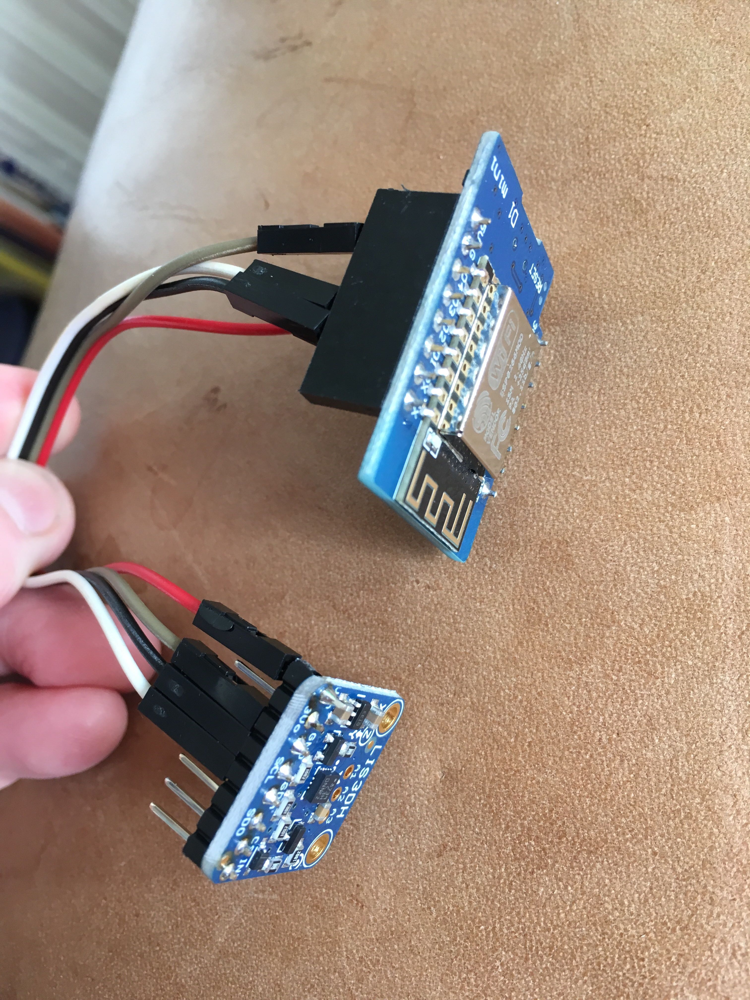

# Display_AP-JS

Code by Ray Burnette, from https://www.hackster.io/rayburne/nodemcu-esp8266-remote-temperature-using-websockets-5956c4 - lightly edited to add in 
accelerometer instead of temperature.

Adapted to use a LIS3DH.

On load it creates an AP - "Oramics" - connect to it to get a popup window to specify 
the wifi network. Get the IP address from the serial.

# Wemos D1 mini pinout

https://escapequotes.net/esp8266-wemos-d1-mini-pins-and-diagram/

# LIS3DH triple axis accelerometer pinout

https://learn.adafruit.com/adafruit-lis3dh-triple-axis-accelerometer-breakout/pinouts

# Together

using 12C - 

    wemos - LIS3DH
    3.3 - VIN
    G - G
    D2 - SDA
    D1 - SCL

# Wemos with Arduino IDE instructions

https://wiki.wemos.cc/tutorials:get_started:get_started_in_arduino

# SPIFFs is a bit weird 

I used this guide:

https://tttapa.github.io/ESP8266/Chap11%20-%20SPIFFS.html

a bit more here:

https://randomnerdtutorials.com/esp32-web-server-spiffs-spi-flash-file-system/

and then this because there was no 'ESP8266 data sketch upload' option in tools:

https://github.com/esp8266/Arduino/issues/5936#issuecomment-478449861

- put it in ~/Documents/Arduino/tools/ESP8266FS/tool/esp8266fs.jar  
